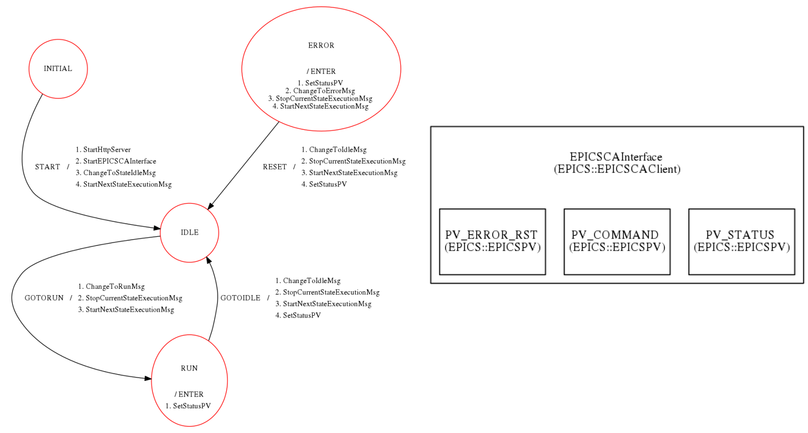

EPICS Example
---------------------------------
---------------------------------

To show an example about how a control system is implemented with the GAMs mentioned in the :doc:`General Common Structure <../structure/structure>`  section, let's analyze the following example, which shows an interface with an EPICS database.

The EPICSCAInterface sends and receives messages to and from a state machine which manages all the process. This is the general scheme:

Let's analyze the system in detail.

The EPICSCAInterface takes into account mainly 3 variables: 

* The status of the system (PV_STATUS)
* The commands received and send to the system (PV_COMMAND)
* Error messages (PV_ERROR_RST)

We start at the state INITIAL, which has 4 actions associated with the start of the system: it first starts the HTTP server and the EPICSCA interface, and after that it asks the state machine to move to the IDLE state, launching the execution message for the next state. Now the state machine is in the IDLE state and keeps reading the message sent by the EPICSCAInterface.

When the state machine receives a message from the EPICSCAInterface, it changes to the Run message ,stops de current state execution message and starts the next execution message, moving to the RUN state by setting the PV_STATUS variable.

When the execution is finished, the state machine receives a message to go back to the IDLE state repeating the previous steps, i.e., changing to the idle state message, stoping the current state message execution, starting the next state execution message and updating the PV_STATUS to IDLE, and the loop continues while the control system is in place.

At some point we may have an ERROR arriving to the state machine. In this case, the PV_STATUS variable is updated indicating that we need to move to the ERROR state, then changing the message to the error message, stoping the current state execution message and starting the next execution message.

After the error is solved, we reset the control system to move again to the IDLE state, changing the status variable and the messages as mentioned before for any state transition.