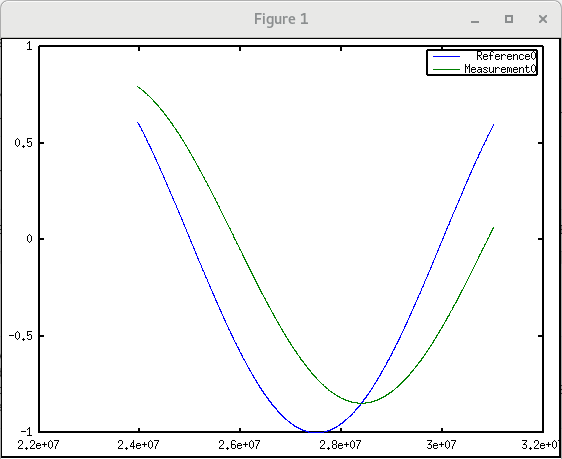

EPICS example 1
---------------

In this example, our app will read from EPICS and the State Machine will react depending on the value of certain variables.

This is the detail about the way the Real Time components work for this examples. 

.. image:: ./epics1_RT1.png
  :width: 800
  :alt: RT components 1

In this example, we are adding some additiona complexity as depending on the state, the system will store data in a file:

.. image:: ./epics1_RT2.png
  :width: 800
  :alt: RT components 2

The configuration file can be downloaded :download:`here <../../../../../../../Projects/MARTe2-demos-padova/Configurations/RTApp-EPICSv3-1.cfg>`.

The first definition we see is for the EPICSCAInterface. It uses the EPICS package classes as defined in the MARTe2-components: ::

  +EPICSCAInterface= {
      Class = EPICS::EPICSCAClient
      StackSize = 1048576
      CPUs = 0x1
      AutoStart = 0
      +PV_STATUS = {
          Class = EPICS::EPICSPV
          PVName = "MARTE2-DEMO-APP:STATUS"
          PVType = int32
      }    
      +PV_COMMAND = {
          Class = EPICS::EPICSPV
          PVName = "MARTE2-DEMO-APP:COMMAND"
          PVType = uint32
          Event = {
              Destination = StateMachine
              PVValue = Function
              FunctionMap = {{"1", "GOTORUN"}, {"0", "GOTOIDLE"}}
          }
      }
      +PV_ERROR_RST = {
          Class = EPICS::EPICSPV
          PVName = "MARTE2-DEMO-APP:RESET"
          PVType = uint32
          Event = {
              Destination = StateMachine
              PVValue = Ignore
              Function = "RESET" 
          }
      }
  }

Mainly, we set the class variables *PV_STATUS*, *PV_COMMAND* and *PV_ERROR_RST* to point to the EPICS variables *MARTE2-DEMO-APP:STATUS*, *MARTE2-DEMO-APP:COMMAND* and *MARTE2-DEMO-APP:RESET*. When there is a change in any of those variables in EPICS, a response from the State Machine will be triggered as we can see in the definition of the StateMachine class: ::

    +StateMachine = {
      Class = StateMachine
      ...
      +RUN = {
          Class = ReferenceContainer
          +ENTER = {
              Class = ReferenceContainer
              +SetStatusPV = {
                  Class = Message
                  Destination = "EPICSCAInterface.PV_STATUS"
                  Function = CAPut
                  Mode = ExpectsReply
                  +Parameters = {
                      Class = ConfigurationDatabase
                      param1 = 1
                  }
              }
          }
          +GOTOIDLE = {
              Class = StateMachineEvent
              NextState = "IDLE"
              NextStateError = "ERROR"
              Timeout = 0         
              +ChangeToIdleMsg = {
                  Class = Message
                  Destination = TestApp
                  Mode = ExpectsReply
                  Function = PrepareNextState
                  +Parameters = {
                      Class = ConfigurationDatabase
                      param1 = Idle
                  }
              }
              +StopCurrentStateExecutionMsg = {
                  Class = Message
                  Destination = TestApp
                  Function = StopCurrentStateExecution
                  Mode = ExpectsReply
              }
              +StartNextStateExecutionMsg = {
                  Class = Message
                  Destination = TestApp
                  Function = StartNextStateExecution
                  Mode = ExpectsReply
              }
              +SetStatusPV = {
                  Class = Message
                  Destination = "EPICSCAInterface.PV_STATUS"
                  Function = CAPut
                  Mode = ExpectsReply
                  +Parameters = {
                      Class = ConfigurationDatabase
                      param1 = 0
                  }
              }
          }   
      }
      ...
    }

The +StateMachine definition includes the 4 states we saw in the :doc:`previous section <../epics1/epics1>`: INITIAL, IDLE, RUN and ERROR and how the state machine will behave in each of them. 

For instance, let's analyze the RUN state. Previously we saw that the when we enter in the RUN state, we set the *PV_STATUS* variable and then, once the execution is finished, we go back to the IDLE status. Let's see how this translates in the configuration file:

First we find the *+ENTER* definition, were we basically set the variable *EPICSCAInterface.PV_STATUS* to 1 using the function *CAPut*. 
After that, we find the definition of the state machine event *+GOTOIDLE*, were we find the 4 actions needed to change status as described in the :doc:`previous section <../epics1/epics1>`: *ChangeToIdleMsg*, *StopCurrentStateExecutionMSg*, *StartNextStateExecutionMsg* and *SetStatusPV*. In each of them, we call the appropriate functions with the corresponding arguments.

In the TestApp definition, we can see several already known GAMs but also the GAMSSM. This GAM class allows for the definition of the state machine matrixes. For more details please check the `SSMGAM Class Reference <https://vcis-jenkins.f4e.europa.eu/job/MARTe2-Components-docs-master/doxygen/classMARTe_1_1SSMGAM.html>`_ page. 

To execute this example, follow these instructions:

We will need 3 different terminals. In console1 execute the following commands: ::

  cd ~/Projects/MARTe2-demos-padova/Configurations
  softIoc -d EPICSv3-demo.db

This will start the EPICS database EPICSv3-dema.db. For additiona information on EPICS, please reffer to `EPICS documentation <https://docs.epics-controls.org/projects/how-tos/en/latest/index.html>`_

In console2 execute: ::

  cd ~/Projects/MARTe2-demos-padova/Startup
  ./Main.sh -l RealTimeLoader -f ../Configurations/RTApp-EPICSv3-1.cfg -m StateMachine:START

And finally, in console3 execute: ::

  caput MARTE2-DEMO-APP:COMMAND 0 && caget MARTE2-DEMO-APP:STATUS && caput MARTE2-DEMO-APP:COMMAND 1 && sleep 2 && caget MARTE2-DEMO-APP:STATUS && sleep 5 && caput MARTE2-DEMO-APP:COMMAND 0

When the prompt is ready again, open the file /tmp/RTApp-EPICSv3-1.csv and remove the last line ::

  octave
  >load('/tmp/RTApp-EPICSv3-1.csv')
  >plot(RTApp_EPICSv3_1(:,1), RTApp_EPICSv3_1(:,2), RTApp_EPICSv3_1(:,1), RTApp_EPICSv3_1(:,6))     
  >legend('Reference0', 'Measurement0')

.. note::
    
    In case octave throws an error when running the plot, it may be necessary to state the graphics_toolkit. You can do it by running a command such as ::

        graphics_toolkit('gnuplot')

before the plot.

This is a plot of the result after the execution, simulating an experiment with reference and measurement values:

