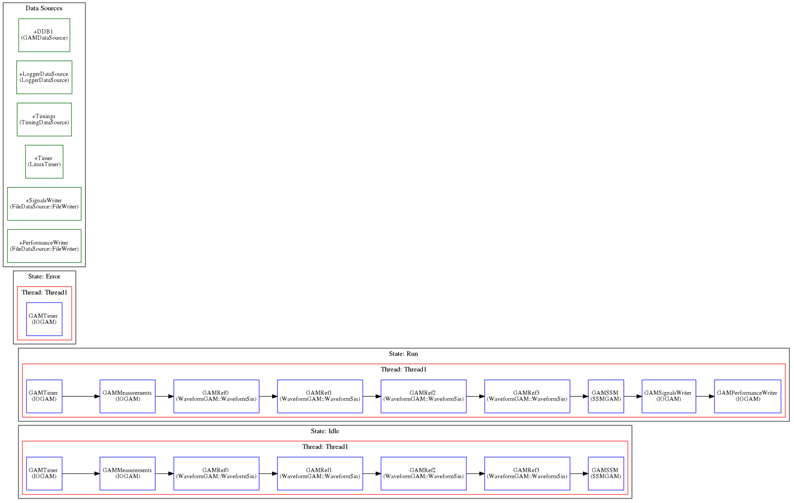

EPICS example 1
---------------

This is the detail about the way the Real Time components work for this examples. As you can see, they make use of the GAMS mentioned in the :doc:`General Common Structure <../structure/structure>`  section.

* Depending on the state, store data in a file

To execute this example, follow the following instructions:

We will need 3 different terminals. In console1 execute the following commands: ::

  cd ~/Projects/MARTe2-demos-padova/Configurations
  softIoc -d EPICSv3-demo.db

This will start the EPICS database EPICSv3-dema.db. For additiona information on EPICS, please reffer to `EPICS documentation <https://docs.epics-controls.org/projects/how-tos/en/latest/index.html>`_

In console2 execute: ::

  cd ~/Projects/MARTe2-demos-padova/Startup
  ./Main.sh -l RealTimeLoader -f ../Configurations/RTApp-EPICSv3-1.cfg -m StateMachine:START

And finally, in console3 execute: ::

  caput MARTE2-DEMO-APP:COMMAND 0 && caget MARTE2-DEMO-APP:STATUS && caput MARTE2-DEMO-APP:COMMAND 1 && sleep 2 && caget MARTE2-DEMO-APP:STATUS && sleep 5 && caput MARTE2-DEMO-APP:COMMAND 0

When the prompt is ready again, open the file /tmp/RTApp-EPICSv3-1.csv and remove the last line ::

  octave
  >load('/tmp/RTApp-EPICSv3-1.csv')
  >plot(RTApp_EPICSv3_1(:,1), RTApp_EPICSv3_1(:,2), RTApp_EPICSv3_1(:,1), RTApp_EPICSv3_1(:,6))
  >legend('Reference0', 'Measurement0')