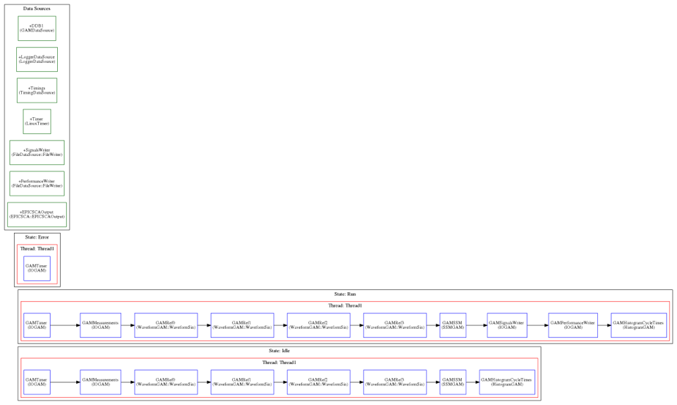
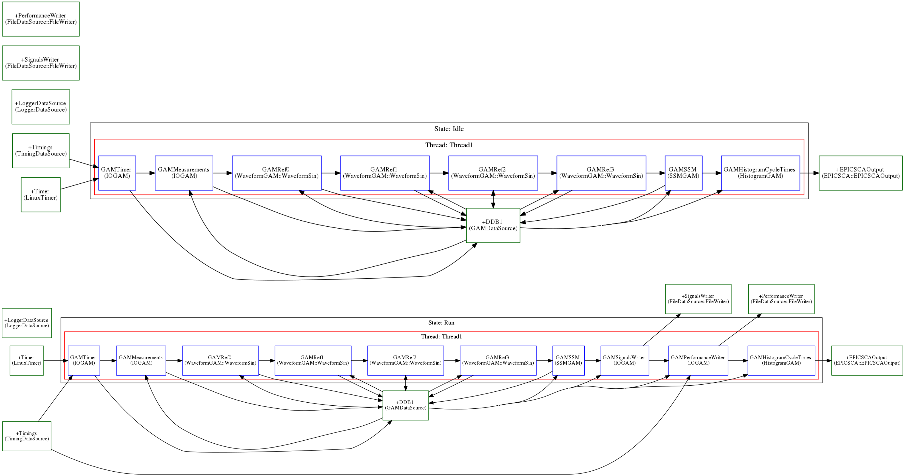

EPICS example 2
---------------

After having seen the previous example where information was stored in a file, next we will see an application which monitors some outputs of the system using EPICSv3, also storing data in a file.

This are the Real Time components for this example:

You can take a look to the configuration file for this example :download:`here <../../../../../../../Projects/MARTe2-demos-padova/Configurations/RTApp-EPICSv3-2.cfg>`. The difference with the previous configuration file is the GAMHistorgramCycleTimes, used to create a Histogram and the EPICSCAOutput, that has the following definition: ::

  +EPICSCAOutput = {
              Class = EPICSCA::EPICSCAOutput
              StackSize = 1048576 
              CPUs = 0x1
              IgnoreBufferOverrun = 1 
              NumberOfBuffers = 10 
              Signals = {
                  Idle_Thread1_CycleTime_Stats = {
                      PVName = "MARTE2-DEMO-APP:HIST-IDLE-CT"
                      Type = uint32 
                  }
                  Run_Thread1_CycleTime_Stats = {
                      PVName = "MARTE2-DEMO-APP:HIST-RUN-CT"
                      Type = uint32 
                  }
              }
          }

As we can see, it refers to the class EPICSCS::EPICSCAOutput and configures two signals: *MARTE2-DEMO-APP:HIST-IDLE-CT* and *MARTE2-DEMO-APP:HIST-RUN-CT*, that will be the ones now driving the State Machine.

To execute this example, follow the following instructions:

We will need 3 different terminals. In console1 execute the following commands: ::

  cd ~/Projects/MARTe2-demos-padova/Configurations
  softIoc -d EPICSv3-demo.db

This will start the EPICS database EPICSv3-dema.db. For additiona information on EPICS, please reffer to `EPICS documentation <https://docs.epics-controls.org/projects/how-tos/en/latest/index.html>`_

In console2 execute: ::

  cd ~/Projects/MARTe2-demos-padova/Startup
  ./Main.sh -l RealTimeLoader -f ../Configurations/RTApp-EPICSv3-2.cfg -m StateMachine:START

And finally, in console3 execute: ::

  camonitor MARTE2-DEMO-APP:HIST-IDLE-CT
