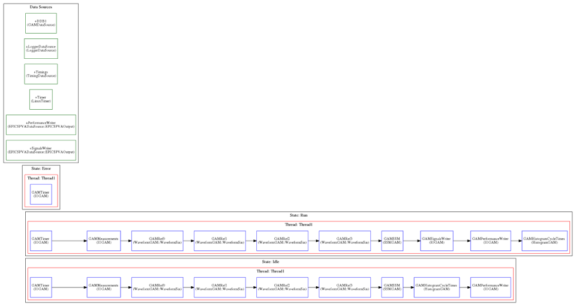
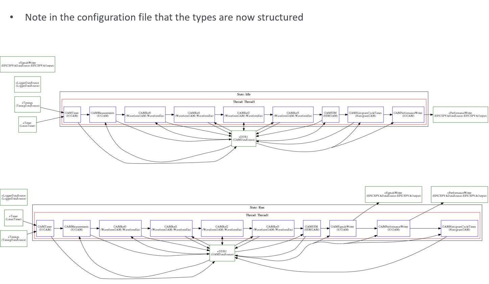

EPICS example 3
---------------

In this case, the objective is to monitor the outputs of the system using EPICSv7. Note how information can be better organized with structured types:

Note in the configuration file that the types are now structured

To execute this example, follow the following instructions:

We will need 3 different terminals. In console1 execute the following commands: ::

  cd ~/Projects/MARTe2-demos-padova/Configurations
  softIoc -d EPICSv3-demo.db

This will start the EPICS database EPICSv3-dema.db. For additiona information on EPICS, please reffer to `EPICS documentation <https://docs.epics-controls.org/projects/how-tos/en/latest/index.html>`_

In console2 execute: ::

  cd ~/Projects/MARTe2-demos-padova/Startup
  ./Main.sh -l RealTimeLoader -f ../Configurations/RTApp-EPICSv7-1.cfg -m StateMachine:START

And finally, in console3 execute: ::

  caput MARTE2-DEMO-APP:COMMAND 1
  pvmonitor MARTe2-Demo-App:Statistics
  pvmonitor MARTe2-Demo-App:Signals
  caput MARTE2-DEMO-APP:COMMAND 0