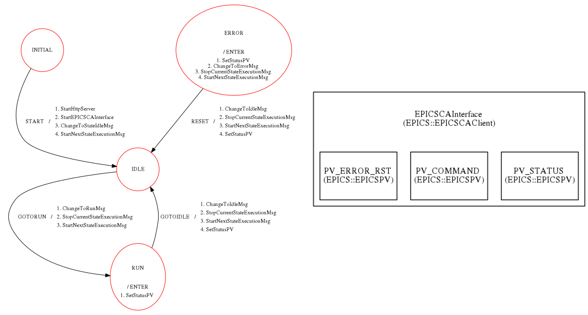

EPICS Introduction
------------------

Now we move into a more complex application. To show an example about how a control system is implemented with the GAMs mentioned in the :doc:`General Common Structure <../generalStructure/main_schematic>`  section, let's analyze an example of an interface with an EPICS database (EPICSCAInterface).

As mentioned in section :doc:`Building <../environment/building>`, EPICS is a set of software tools used in distributed control systems allowing communication between the different components and providing control and feedback of the various parts of the devices from a central control room, or even remotely over the internet.

So in this example we will see how the EPICSCAInterface sends and receives messages to and from a state machine which defines the behaviour of the control system. This is the general scheme:

Let's analyze the system in detail. The EPICSCAInterface takes into account mainly 3 variables: 

* The status of the system (PV_STATUS)
* The commands received and send to the system (PV_COMMAND)
* Error messages (PV_ERROR_RST)

We start at the state INITIAL, which has 4 actions associated with the start of the system: it first starts the HTTP server and the EPICSCA interface, and after that it asks the state machine to move to the IDLE state, launching the execution message for the next state. 

After that, the state machine is in the IDLE state and keeps reading the status of the EPICS variables until there is a change. At that point, it sends the ChangeToRunMsg message, stops the IDLE state execution and starts the next execution message, moving to the RUN state.

In the RUN state, first the PV_STATUS variable is updated. When the execution is finished, the state machine changes to the ChangeToIdleMsg message, stops the current state execution, starts the next state execution message and sets the PV_STATUS for the new state, and the loop continues while the control system is in place.

At some point we may have an ERROR arriving to the state machine. In this case, the PV_STATUS variable is updated indicating that we need to move to the ERROR state, then changing the message to the error message, stoping the current state execution message and starting the next execution message.

After the error is solved, we reset the control system to move again to the IDLE state, changing the status variable and the messages as mentioned before for any state transition.

Next let's see different examples of behaviour of the state machine.

