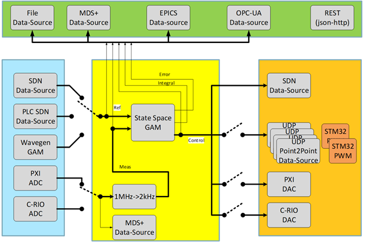

General Common Structure
------------------------
------------------------

After the examples that we have already seen, we can now move to more complex applications. Our focus now would be get acquainted with additional resources that MARTe2 offers that could be used in real Control Systems.

In general terms, any control system would have a structure similar to the following one that we will take as example to work with: 

Folowing an structured approach, we can differentiate the following parts in a Control System: 

* **Input/Output**: The hardware that we need to control is connected to the Control System by a set of instruments providing input and output signals. These signals may come from different hardware platforms, such as PXI, SDN, etc.

* **Measurement and Control**: The input signals are measured and passed to the Control System - in our case the State Space GAM - where the control algorithms that will stablish the controlling rules sit. These controlling roules are implemented by means of a set of states and their associated messages. This is then provided as output to the instrumentation that will update the system as needed.

* **Storage**: In addition to establishing the rules of the system and receiving from/loading into the instrumentation the appropriate information, the Control System should store all the relevant information in a database (EPICS, MDS+, etc.) for subsequent use.

In our case, MARTe2 provides support to all these activities via a set of GAMs included in the MARTe2-components package, that we can complement as needed with dedicated ones. Some of the components provided of-the-shelf with MARTe2 are the already well-known `IOGAM <https://vcis-jenkins.f4e.europa.eu/job/MARTe2-Components-docs-master/doxygen/classMARTe_1_1IOGAM.html#details>`_ that as we have seen is used to manage the input/output operations serving as a direct link between Datasources, allowing for a transparent interchange of data between them, even if their protocols are not initially compatible or the `HistogramGAM <https://vcis-jenkins.f4e.europa.eu/job/MARTe2-Components-docs-master/doxygen/classMARTe_1_1HistogramComparator.html#details>`_ GAM, that determines to which bin of a histogram belongs a given occurrence.  

With all this in mind we can start creating an introductory MARTe2-based Control System application.

