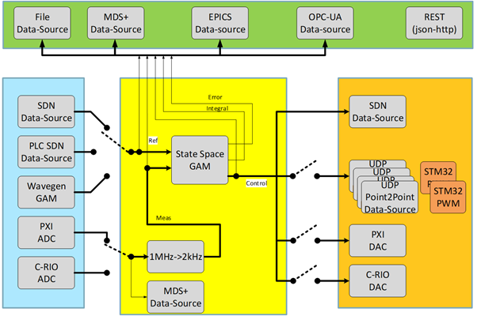

General Common Structure
---------------------------------
---------------------------------

The examples shown in this tutorial share the following common general structure, which describes in general terms, the main parts of any kind of Control System: 

In general, we can differentiate the following stages in a Control System: 

* **Input/Output**: The hardware that we need to control is connected to the Control System by means of a set of instruments providing input and output signals. These signals may come from different hardware platforms, such as PXI, SDN, etc.

* **Measurement and Control**: The input signals are measured and passed to the State Space GAM, where the control algorithms that will stablish the controlling rules sit. These controlling roules are implemented by means of a set of states and their associated messages. This is then provided as output to the instrumentation that will update the system as needed.

* **Storage**: In addition to establishing the rules of the system and receiving and updating the information on the instrumentation, all the relevant information is stored in an appropriate database (EPICS, MDS+, etc.) for subsequent use.

All these parts are supported by a set of GAMs, which may come included in the MARTe2 components library or that can be programmed by the end-user. 
Let’s see now in more detail some of the GAMs used in the examples in this training:

**Input/Output**:

* `IOGAM <https://vcis-jenkins.f4e.europa.eu/job/MARTe2-Components-docs-master/doxygen/classMARTe_1_1IOGAM.html#details>`_: This is a GAM which is used to manage the input/output operations. It serves as a direct link between Datasources, allowing for a transparent interchange of data between them, even if their protocols are not initially compatible.

**Measurement and Control**:

* `SSMGAM <https://vcis-jenkins.f4e.europa.eu/job/MARTe2-Components-docs-master/doxygen/classMARTe_1_1SSMGAM.html>`_: This GAM is the core of the Control System. It implements a Generic State Space Model that defines the control system equations:

    *x[k+1] = Ax[k]+Bu[k]* 

    *y[k] = Cx[k]+Du[k]*

From the input vector u[k], the system of equations generate the so called output vector y[k] with dimensions [q x 1] and the state vector x[k] with 
dimensions [n x 1], which control the change between states of the system.

Also, MARTe2 provides with some additional GAMs that provide supporting features:

* `WaveformGAM <https://vcis-jenkins.f4e.europa.eu/job/MARTe2-Components-docs-master/doxygen/classMARTe_1_1Waveform.html#details>`_: This GAM provides with the generic common functions and variables to generate any kind of waveform signal. It is the base for derived clases such as the `WaveformSinpGAM <https://vcis-jenkins.f4e.europa.eu/job/MARTe2-Components-docs-master/doxygen/classMARTe_1_1WaveformSin.html>`_ or the `WaveformChirpGAM <https://vcis-jenkins.f4e.europa.eu/job/MARTe2-Components-docs-master/doxygen/classMARTe_1_1WaveformChirp.html>`_, for example.

* `HistogramGAM <https://vcis-jenkins.f4e.europa.eu/job/MARTe2-Components-docs-master/doxygen/classMARTe_1_1HistogramComparator.html#details>`_: This GAM computes compute to which bin of the histogram belongs a given occurrence.  

